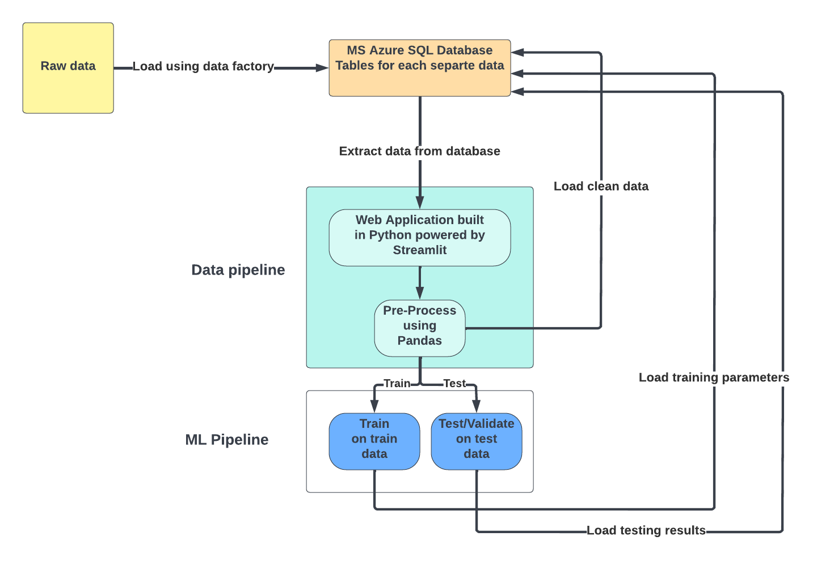

# Churn-Predication-Pipeline-Using-Azure-Cloud-

### ETL Pipeline:

### Problem Statement:
We aim to accomplish the following for this project:
1. Identify which factors contribute to customer churn.
2. Classify if a customer is going to churn or not.
### Description:
We aim to use first stream OLTP web based through which
1. We'll create a SQL database in MS Azure with multiple tables as per the dataset.
2. Connect the cloud database with web-based system developed in python.
3. Apply Machine Learning Algorithms
4. Create web interface using Streamlit.

We train our model on classifier by using Support Vector Machine (SVM)/Logistic Regression, so our main aim is to predict the customers that will possibly churn so they can be put in some sort of scheme to prevent churn or to churned.
